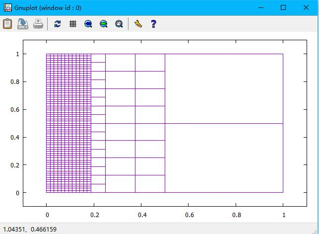
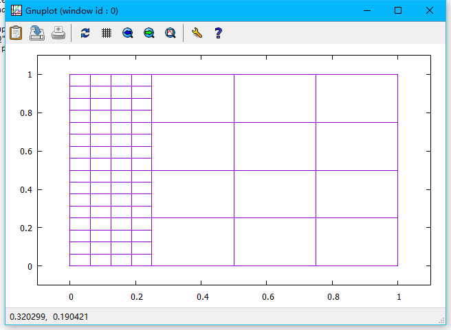
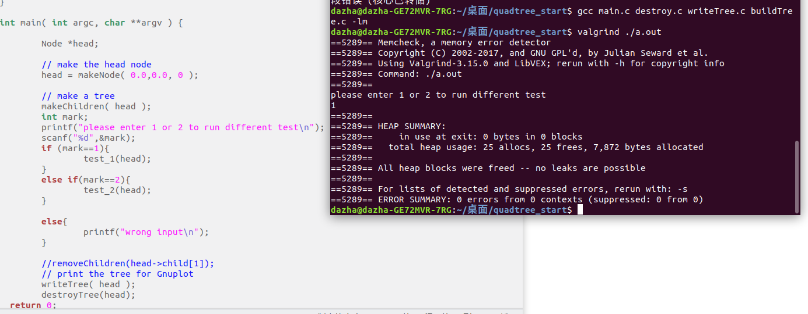
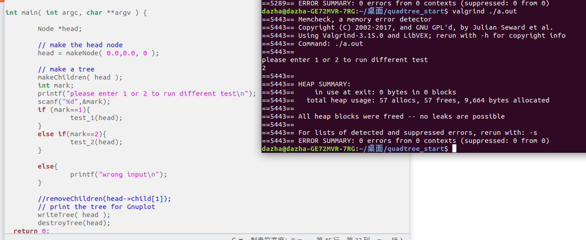
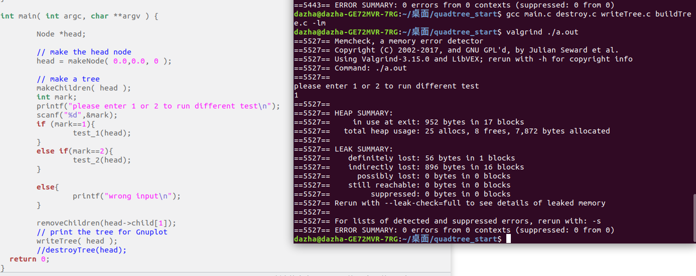
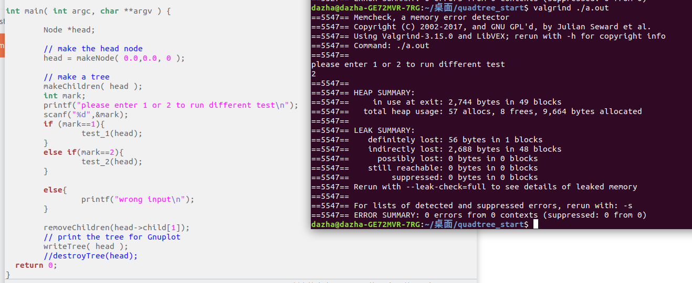
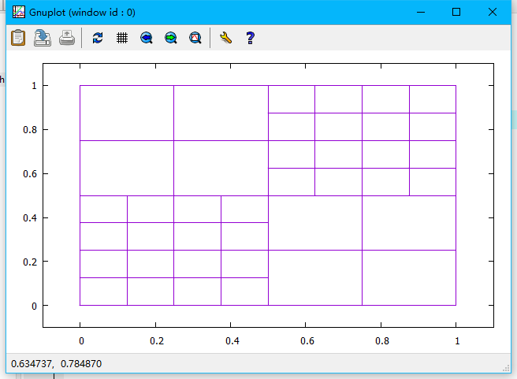
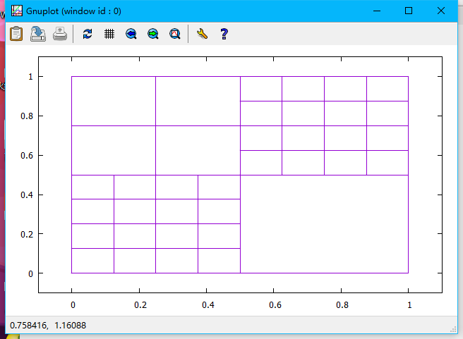

version_9 of the Project_1_quadtree

In this version, full comments were integrated to all code, and in "main.c", the code was  seperated by different tasks and tests. Moreover, all pictures were sorted and uploaded.

version_8 of the Project_1_quadtree

In this version,  task 3 extended was finished. One addtional function was merged into the file "nodeValue.c" named "adapt()". While this function was capable to tontiunes running the stage_1() and stage_2() in order to automatically generate/remove nodes, until the tree does not change(by taking advantages of the counts of the added and removed nodes)

The demostration pictures of setting the maxLevel=6 shows below: 

version_7 of the Project_1_quadtree

In this version, task 3 was accomplished. Two files were added into the code named "nodeValue.c" and "nodeValue.h",  and two additonal functions were integrated to the original version called "stage_1" and "stage_2". These two functions were able to generate a quadtree automatically based on a given funciton F(x,y) in 2D space. The results in gnuplot was showed as below:

version_6 of the Project_1_quadtree

In this version, 4 pictures were uploaded to the files. The four pictures were taken as the screenshots of testing while using valgrind in Ubuntu system, in order to find out where there is any memory leak from the C programme. All the four screenshots were under the directory "valgrin_pic".

Testing destroyTree() during test_1:

Testing destroyTree() during test_2:

Testing removeChildren() during test_1:

Testing removeChildren() during test_2:

version_5 of the Project_1_quadtree

In this version,  one function named removeChildren was created to finish this task, which take one argument "Node * paren*" as parameter. The function was capable to remove all the children from one parent node, with assuming that all children are leaf nodes according to the reqirement(in another word, no recursion was used in the function.) The working pattern was simple, just used free() function to all four children nodes of the gigin parent node if they existed. 

before running the function:

after running the function:

version_4 of the Project_1_quadtree

In this version, two files are added in to the code, 'destory.h' and 'destory.c'.

In these files, the implementation of function named destory_tree() is completed, which could recursively remove all the nodes of the tree. To be more specifically, the leaf node will be removed first, and the root will be done at the end.

before running the function:

after running the function:

