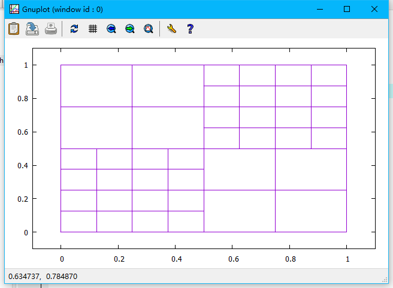
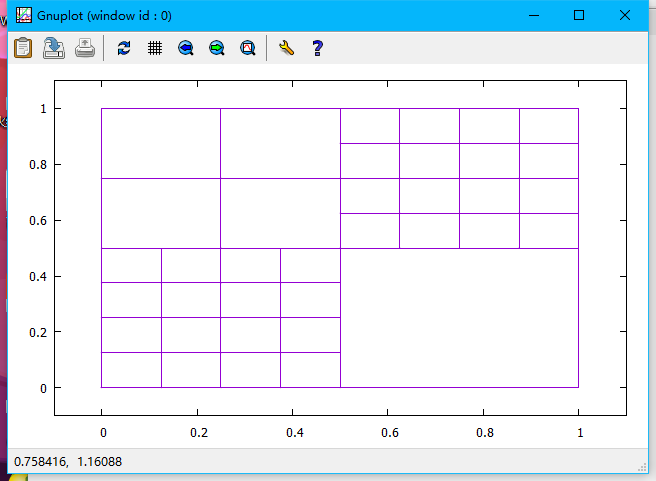

version_5 of the Project_1_quadtree

In this version,  one function named removeChildren was created to finish this task, which take one argument "Node * paren*" as parameter. The function was capable to remove all the children from one parent node, with assuming that all children are leaf nodes according to the reqirement(in another word, no recursion was used in the function.) The working pattern was simple, just used free() function to all four children nodes of the gigin parent node if they existed. 

before running the function:

after running the function:

version_4 of the Project_1_quadtree

In this version, two files are added in to the code, 'destory.h' and 'destory.c'.

In these files, the implementation of function named destory_tree() is completed, which could recursively remove all the nodes of the tree. To be more specifically, the leaf node will be removed first, and the root will be done at the end.

before running the function:

after running the function:

